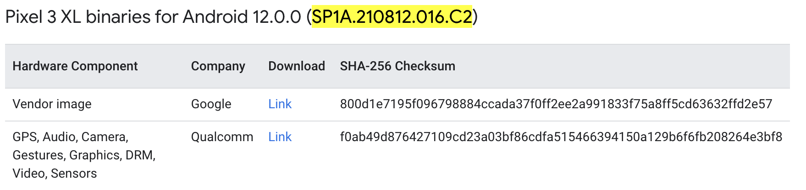

# 2022-08-15-aops-build-for-pixel3xl
---
layout: post
title:  
date:   2022-08-15 20:53:06
author: haoxiqiang
categories: blog
tags: [aosp,android,pixel3xl]
image:
  feature:
  teaser:
  credit:
  creditlink:
---

** 默认已拉取AOSP源码并同步完成 **

* 查找对应型号的BuildID
    https://source.android.com/setup/start/build-numbers#source-code-tags-and-builds
    搜索 Pixel 3 XL 获取最新BuildId `SP1A.210812.016.C2`
* 搜索下载对应BuildID的驱动
    https://developers.google.com/android/drivers/
    
* 解压提取驱动
   ```bash
    mkdir vendor_backup && cd vendor_backup
    wget https://dl.google.com/dl/android/aosp/google_devices-crosshatch-sp1a.210812.016.c2-a4e274b7.tgz
    wget https://dl.google.com/dl/android/aosp/qcom-crosshatch-sp1a.210812.016.c2-00a7f1f3.tgz
    tar xvf qcom-crosshatch-*.tgz
    tar xvf google_devices-crosshatch-*.tgz
    ./extract-google_devices-crosshatch.sh
    ./extract-qcom-crosshatch.sh
    mv vendor/ ../
   ```
   
   
   